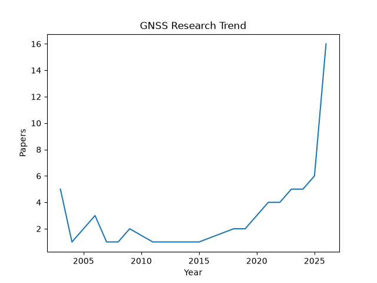

# 📡 GNSS Literature Hub

Automatically updated GNSS papers.

## 📈 Trend

## 📚 Latest Papers

### Accurate topside ionospheric TEC estimation using LEO satellites with onboard GPS observations
- Ren, Wu, Le, Yang, Yang, Jian, Zhang (2026)
- *GPS Solutions*
- **Keywords:** accurate, estimation, gps, ionospheric, leo
- **Abstract:** ...
- [Link](https://doi.org/10.1007/s10291-026-02107-8)

### A precise global ionospheric total electron content forecasting model based on multi-neural network ensemble
- Zhang, Han, Peng, Zhang, Xu, Huang, Tang, Kong, Yao, Pan, Huang, Li, Chen (2026)
- *GPS Solutions*
- **Keywords:** based, content, electron, ensemble, forecasting
- **Abstract:** ...
- [Link](https://doi.org/10.1007/s10291-026-02079-9)

### Inter-augmentation SIS bias (IASB): a novel integrity monitor for QZSS CLAS PPP-RTK
- Shiono, Kubo (2026)
- *GPS Solutions*
- **Keywords:** ppp, iasb, integrity, rtk, sis
- **Abstract:** Abstract
                  Bottom-up PPP-RTK services, such as QZSS CLAS, generate corrections using local reference station networks. Prior work identified “Error Cross-Contamination,” where global errors leak into local atmospheric estimates. This study addresses the inverse risk: local anomalies—...
- [Link](https://doi.org/10.1007/s10291-026-02109-6)

### LEO satellite clock prediction using deep learning: a wavelet–LSTM method with autoformer and LSTM comparisons
- Wang, Wu, Wang, Xie (2026)
- *GPS Solutions*
- **Keywords:** lstm, autoformer, clock, comparisons, deep
- **Abstract:** ...
- [Link](https://doi.org/10.1007/s10291-026-02110-z)

### Enhanced PPP-RTK in mountainous regions using a 3D grid-based elevation normalization model
- Li, Wang, Li, Huang, Zheng, Han (2026)
- *GPS Solutions*
- **Keywords:** 3d, based, elevation, enhanced, grid
- **Abstract:** ...
- [Link](https://doi.org/10.1007/s10291-026-02106-9)

### A clustered-user PPP-RTK method
- Zhong, Zhang (2026)
- *GPS Solutions*
- **Keywords:** clustered, method, ppp, rtk, user
- **Abstract:** ...
- [Link](https://doi.org/10.1007/s10291-026-02115-8)

### GMR-water: a water level retrieval software for multi-GNSS, multi-frequence and multi-observation based on GNSS-MR
- Yang, Hao (2026)
- *GPS Solutions*
- **Keywords:** multi, gnss, water, based, frequence
- **Abstract:** ...
- [Link](https://doi.org/10.1007/s10291-026-02111-y)

### The influence of native temporal resolution on the performance of real-time global ionospheric maps
- Wang, Liu, Hernández-Pajares, Monte-Moreno, Yang, Yang, Zhang, Olivares-Pulido, Xu (2026)
- *GPS Solutions*
- **Keywords:** global, influence, ionospheric, maps, native
- **Abstract:** ...
- [Link](https://doi.org/10.1007/s10291-026-02113-w)

### An exponential optimized fitting coefficients wide-area tropospheric corrections model and its application in PPP-IAR
- Lei, Guo, Yang, Tao, Jiang, Zhao (2026)
- *GPS Solutions*
- **Keywords:** application, area, coefficients, corrections, exponential
- **Abstract:** ...
- [Link](https://doi.org/10.1007/s10291-026-02100-1)

### Deep reinforcement learning with robust spatial–temporal representation for improving GNSS positioning correction
- Li, Li, Tang, Song, Chen, Cai, Xie (2026)
- *GPS Solutions*
- **Keywords:** correction, deep, gnss, improving, learning
- **Abstract:** ...
- [Link](https://doi.org/10.1007/s10291-026-02103-y)

### Platform-terminal interactive VRS observation generation method for GNSS network RTK positioning
- Gao, Liu, Pan, Zhang (2026)
- *GPS Solutions*
- **Keywords:** generation, gnss, interactive, method, network
- **Abstract:** ...
- [Link](https://doi.org/10.1007/s10291-026-02098-6)

### Real-time quality indicator determination for precise satellite orbit and clock corrections from integrity perspective
- Wang, Li, Li, Zheng, Ma (2026)
- *GPS Solutions*
- **Keywords:** clock, corrections, determination, indicator, integrity
- **Abstract:** ...
- [Link](https://doi.org/10.1007/s10291-026-02105-w)

### Standalone and RTK GNSS on 30,000 km of North American Highways
- Tyler G. R. Reid, Nahid Pervez, Umair Ibrahim, Sarah E. Houts, Gaurav Pandey, Naveen K. R. Alla, Andy Hsia (2019)
- *arXiv*
- **Keywords:** gnss, determination, rtk, lane, road
- **Abstract:** There is a growing need for vehicle positioning information to support Advanced Driver Assistance Systems (ADAS), Connectivity (V2X), and Automated Driving (AD) features. These range from a need for road determination (<5 meters), lane determination (<1.5 meters), and determining where the vehicle i...
- [Link](https://arxiv.org/abs/1906.08180v3)

### GNSS Radio Occultation on Aerial Platforms with Commercial Off-The-Shelf Receivers
- Bryan C. Chan, Ashish Goel, Jonathan Kosh, Tyler G. R. Reid, Corey R. Snyder, Paul M. Tarantino, Saraswati Soedarmadji, Widyadewi Soedarmadji, Kevin Nelson, Feiqin Xie, Michael Vergalla (2021)
- *arXiv*
- **Keywords:** gnss, weather, commercial, ro, cost
- **Abstract:** In recent decades, GNSS Radio Occultation soundings have proven an invaluable input to global weather forecasting. The success of government-sponsored programs such as COSMIC is now complemented by commercial low-cost cubesat implementations. The result is access to more than 10,000 soundings per da...
- [Link](https://arxiv.org/abs/2109.13328v1)

### Ford Highway Driving RTK Dataset: 30,000 km of North American Highways
- Sarah E. Houts, Nahid Pervez, Umair Ibrahim, Gaurav Pandey, Tyler G. R. Reid (2020)
- *arXiv*
- **Keywords:** dataset, driving, ford, gnss, meters
- **Abstract:** There is a growing need for vehicle positioning information to support Advanced Driver Assistance Systems (ADAS), Connectivity (V2X), and Autonomous Driving (AD) features. These range from a need for road determination ($<$5 meters), lane determination ($<$1.5 meters), and determining where the vehi...
- [Link](https://arxiv.org/abs/2010.01774v1)

### Xona Pulsar Compatibility with GNSS
- Tyler G. R. Reid, Matteo Gala, Mathieu Favreau, Argyris Kriezis, Michael O'Meara, Andre Pant, Paul Tarantino, Christina Youn (2025)
- *arXiv*
- **Keywords:** pulsar, gnss, compatibility, existing, band
- **Abstract:** At least ten emerging providers are developing satellite navigation systems for low Earth orbit (LEO). Compatibility with existing GNSS in L-band is critical to their successful deployment and for the larger ecosystem. Xona is deploying Pulsar, a near 260-satellite LEO constellation offering dual L-...
- [Link](https://arxiv.org/abs/2509.16183v3)

### Impact of RTK Augmentation and INS Integration on GNSS Positioning Accuracy and Continuity: A Benchmarking Study on Inland Waterways
- Yan-Yun Zhang, Jef Billet, Jan Swevers, Peter Slaets (2026)
- *arXiv*
- **Keywords:** gnss, rtk, ins, augmentation, integration
- **Abstract:** RTK augmentation andINS integration are widely used to improve GNSS positioning performance. However, on inland waterways, bridges and surrounding structures can degrade satellite visibility and correction availability, causing RTK augmentation loss, and GNSS/INS fusion transients. Since these effec...
- [Link](https://arxiv.org/abs/2606.06358v1)

### Participatory Sensing for Localization of a GNSS Jammer
- Glädje Karl Olsson, Erik Axell, Erik G. Larsson, Panos Papadimitratos (2022)
- *arXiv*
- **Keywords:** sensing, gnss, jamming, localization, participatory
- **Abstract:** GNSS receivers are vulnerable to jamming and spoofing attacks, and numerous such incidents have been reported worldwide in the last decade. It is important to detect attacks fast and localize attackers, which can be hard if not impossible without dedicated sensing infrastructure. The notion of parti...
- [Link](https://arxiv.org/abs/2204.13974v1)

### Robust state and protection-level estimation within tightly coupled GNSS/INS navigation system
- Shuchen Liu, Kaizheng Wang, Dirk Abel (2021)
- *arXiv*
- **Keywords:** navigation, estimation, gnss, level, protection
- **Abstract:** In autonomous applications for mobility and transport, a high-rate and highly accurate vehicle-state estimation is achieved by fusing measurements of global navigation satellite systems (GNSS) and inertial sensors. The state estimation and its protection-level generation often suffer from satellite-...
- [Link](https://arxiv.org/abs/2103.10696v3)

### 3D LiDAR Aided GNSS NLOS Mitigation for Reliable GNSS-RTK Positioning in Urban Canyons
- Xikun Liu, Weisong Wen, Feng Huang, Han Gao, Yongliang Wang, Li-Ta Hsu (2022)
- *arXiv*
- **Keywords:** gnss, measurements, lidar, positioning, rtk
- **Abstract:** GNSS and LiDAR odometry are complementary as they provide absolute and relative positioning, respectively. Their integration in a loosely-coupled manner is straightforward but is challenged in urban canyons due to the GNSS signal reflections. Recent proposed 3D LiDAR-aided (3DLA) GNSS methods employ...
- [Link](https://arxiv.org/abs/2212.05477v1)

### POSTER: Testing network-based RTK for GNSS receiver security
- Marco Spanghero, Panos Papadimitratos (2024)
- *arXiv*
- **Keywords:** rtk, gnss, errors, navigation, network
- **Abstract:** Global Navigation Satellite Systems (GNSS) provide precise location, while Real Time Kinematics (RTK) allow mobile receivers (termed rovers), leveraging fixed stations, to correct errors in their Position Navigation and Timing (PNT) solution. This allows compensating for multi-path effects, ionosphe...
- [Link](https://arxiv.org/abs/2405.10906v1)

### Time-Relative RTK-GNSS: GNSS Loop Closure in Pose Graph Optimization
- Taro Suzuki (2023)
- *arXiv*
- **Keywords:** gnss, graph, pose, rtk, technique
- **Abstract:** A pose-graph-based optimization technique is widely used to estimate robot poses using various sensor measurements from devices such as laser scanners and cameras. The global navigation satellite system (GNSS) has recently been used to estimate the absolute 3D position of outdoor mobile robots. Howe...
- [Link](https://arxiv.org/abs/2312.02448v1)

### An RTK-SLAM Dataset for Absolute Accuracy Evaluation in GNSS-Degraded Environments
- Wei Zhang, Vincent Ress, David Skuddis, Uwe Soergel, Norbert Haala (2026)
- *arXiv*
- **Keywords:** rtk, slam, accuracy, dataset, absolute
- **Abstract:** RTK-SLAM systems integrate simultaneous localization and mapping (SLAM) with real-time kinematic (RTK) GNSS positioning, promising both relative consistency and globally referenced coordinates for efficient georeferenced surveying. A critical and underappreciated issue is that the standard evaluatio...
- [Link](https://arxiv.org/abs/2604.07151v1)

### GNSS-R: Operational Applications
- G. Ruffini, O. Germain, F. Soulat, M. Taani, M. Caparrini (2003)
- *arXiv*
- **Keywords:** gnss, applications, instrument, surface, future
- **Abstract:** This paper provides an overview of operational applications of GNSS-R, and describes Oceanpal, an inexpensive, all-weather, passive instrument for remote sensing of the ocean and other water surfaces. This instrument is based on the use of reflected signals emitted from GNSS, and it holds great pote...
- [Link](https://arxiv.org/abs/physics/0310063v2)

### GPS Receiver with Enhanced User Positioning Time
- Seung-Hyun Yoon, Ji-Woon Jung, Su-Bong Kim, Hyun-Chang Shin, Jae-Hyang Lee, Kyu-Yun Lee, Hyo-Sun Shim (2015)
- *arXiv*
- **Keywords:** gps, receiver, user, position, positioning
- **Abstract:** This paper introduces a Global Positioning System (GPS) Receiver that locates user's position instantly. Recently, many mobile devices require location information to add user position into their contents, and some applications require quick positioning when the device is initially switched on. In o...
- [Link](https://arxiv.org/abs/1510.03062v1)

### Automatic Operation of an Articulated Dump Truck: State Estimation by Combined QZSS CLAS and Moving-Base RTK Using Multiple GNSS Receivers
- Taro Suzuki, Shotaro Kojima, Kazunori Ohno, Naoto Miyamoto, Takahiro Suzuki, Kimitaka Asano, Tomohiro Komatsu, Hiroto Kakizaki (2025)
- *arXiv*
- **Keywords:** gnss, rtk, dump, estimation, state
- **Abstract:** Labor shortage due to the declining birth rate has become a serious problem in the construction industry, and automation of construction work is attracting attention as a solution to this problem. This paper proposes a method to realize state estimation of dump truck position, orientation and articu...
- [Link](https://arxiv.org/abs/2506.02877v1)

### The GNSS-R Eddy Experiment I: Altimetry from Low Altitude Aircraft
- G. Ruffini, F. Soulat, M. Caparrini, O. Germain, M. Martin-Neira (2003)
- *arXiv*
- **Keywords:** gnss, gps, surface, aircraft, altimetric
- **Abstract:** We report results from the Eddy Experiment, where a synchronous GPS receiver pair was flown on an aircraft to collect sampled L1 signals and their reflections from the sea surface to investigate the altimetric accuracy of GNSS-R. During the experiment, surface wind speed (U10) was of the order of 10...
- [Link](https://arxiv.org/abs/physics/0310092v1)

### PARFAIT: GNSS-R coastal altimetry
- M. Caparrini, L. Ruffini, G. Ruffini (2003)
- *arXiv*
- **Keywords:** coherent, gnss, altimetry, component, gps
- **Abstract:** GNSS-R signals contain a coherent and an incoherent component. A new algorithm for coherent phase altimetry over rough ocean surfaces, called PARFAIT, has been developed and implemented in Starlab's STARLIGHT GNSS-R software package. In this paper we report our extraction and analysis of the coheren...
- [Link](https://arxiv.org/abs/physics/0311052v1)

### Efectos relativistas en los sistemas Galileo, GPS y GLONASS
- J. -F. Pascual-Sánchez (2004)
- *arXiv*
- **Keywords:** gps, galileo, glonass, project, alternative
- **Abstract:** Nowadays, the Global Navigation Satellite Systems (GNSS), working like global positioning systems, are the GPS (NAVSTAR) and the GLONASS, which only are operative when several relativistic effects are corrected. In the next years the Galileo system will be constructed, copying the GPS System if ther...
- [Link](https://arxiv.org/abs/gr-qc/0405100v1)

### Decoding PPP Corrections from BDS B2b Signals Using a Software-defined Receiver: an Initial Performance Evaluation
- Xiangchen Lu, Liang Chen, Nan Shen, Lei Wang, Zhenhang Jiao, Ruizhi Chen (2020)
- *arXiv*
- **Keywords:** ppp, bds, corrections, service, b2b
- **Abstract:** With the rapid development of China's BeiDou Navigation Satellite System(BDS), the application of real-time precise point positioning (RTPPP) based on BDS has become an active research area in the field of Global Navigation Satellite System (GNSS). BDS has provided the service of broadcasting RTPPP ...
- [Link](https://arxiv.org/abs/2011.13539v1)

