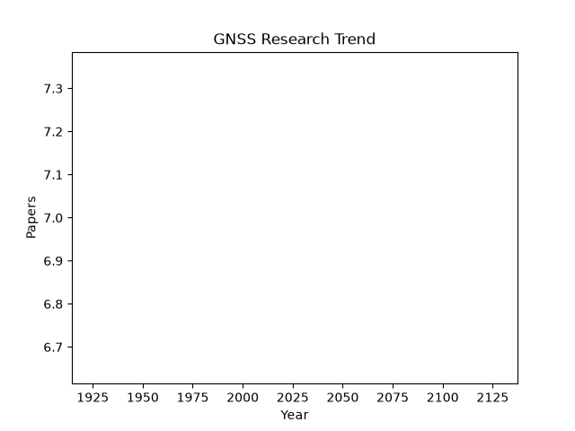

# 📡 GNSS Literature Hub

Automatically updated GNSS papers.

## 📈 Trend

## 📚 Latest Papers

### Multi-facility GNSS antenna calibration
- Kersten, Kröger, Schön, Bilich, Sutyagin, Schmitz, Dreier, Kuhlmann, Caizzone, Soja, Brown, Möller, Hu, Hu, Villiger (2026)
- *Journal of Geodesy*
- **Keywords:** gnss, antenna, calibration, facilities, igs
- **Abstract:** Abstract
                  Accurate antenna calibrations are a cornerstone of high-quality global navigation satellite systems (GNSS) positioning, time and frequency transfer, precise orbits, and troposphere estimates. The international GNSS service (IGS) antenna committee maintains antenna phase ce...
- [Link](https://doi.org/10.1007/s00190-026-02111-3)

### Deriving sub-daily polar motion from BeiDou: assessment and analysis with emphasis on the impact of constellation configurations
- Li, Yao, Yuan, Zheng, Zhou (2026)
- *Journal of Geodesy*
- **Keywords:** analysis, assessment, beidou, configurations, constellation
- **Abstract:** ...
- [Link](https://doi.org/10.1007/s00190-026-02113-1)

### An all-GNSS PPP-RTK model with consideration of ambiguity-like code biases
- Che, Hou, Ye, Zheng, Zhang (2026)
- *GPS Solutions*
- **Keywords:** ambiguity, biases, code, consideration, gnss
- **Abstract:** ...
- [Link](https://doi.org/10.1007/s10291-026-02146-1)

### Residual unwrapping and stacking for mitigating large-magnitude GNSS phase multipath and diffraction errors
- Tian, Zhang, Dai, Sun, Wen (2026)
- *GPS Solutions*
- **Keywords:** diffraction, errors, gnss, large, magnitude
- **Abstract:** ...
- [Link](https://doi.org/10.1007/s10291-026-02149-y)

### Analysis of Tonga eruption-induced disturbances in the upper thermosphere based on atmospheric drag accelerations from LEO satellites
- She, Hernández-Pajares, Olivares-Pulido, Huang, Wang, Zhu, Lai (2026)
- *GPS Solutions*
- **Keywords:** density, disturbances, eruption, km, leo
- **Abstract:** Abstract
                  
                    The violent eruption of the Tonga volcano on 15 January 2022 triggered significant disturbances in the atmosphere and ionosphere. However, limited observational capabilities have persistently hindered the characterization of eruption-induced neutral de...
- [Link](https://doi.org/10.1007/s10291-026-02150-5)

### Impact of piece-wise linear receiver clock modeling on sub-daily PPP coordinates for highly stable IGS H-maser stations
- Widczisk, Männel, Wickert (2026)
- *GPS Solutions*
- **Keywords:** wise, clock, linear, piece, stable
- **Abstract:** Abstract
                  Modeling highly stable GNSS receiver clocks helps to increase the stability of correlated parameters, especially the station height. The use of a piece-wise linear receiver clock model, which is a common method for clock parametrization in Very Long Baseline Interferometry...
- [Link](https://doi.org/10.1007/s10291-026-02147-0)

### Correction: Projected BIE: a new unbiased minimum variance estimator for the mixed-integer GNSS model
- Teunissen (2026)
- *GPS Solutions*
- **Keywords:** bie, correction, estimator, gnss, integer
- **Abstract:** ...
- [Link](https://doi.org/10.1007/s10291-026-02134-5)

